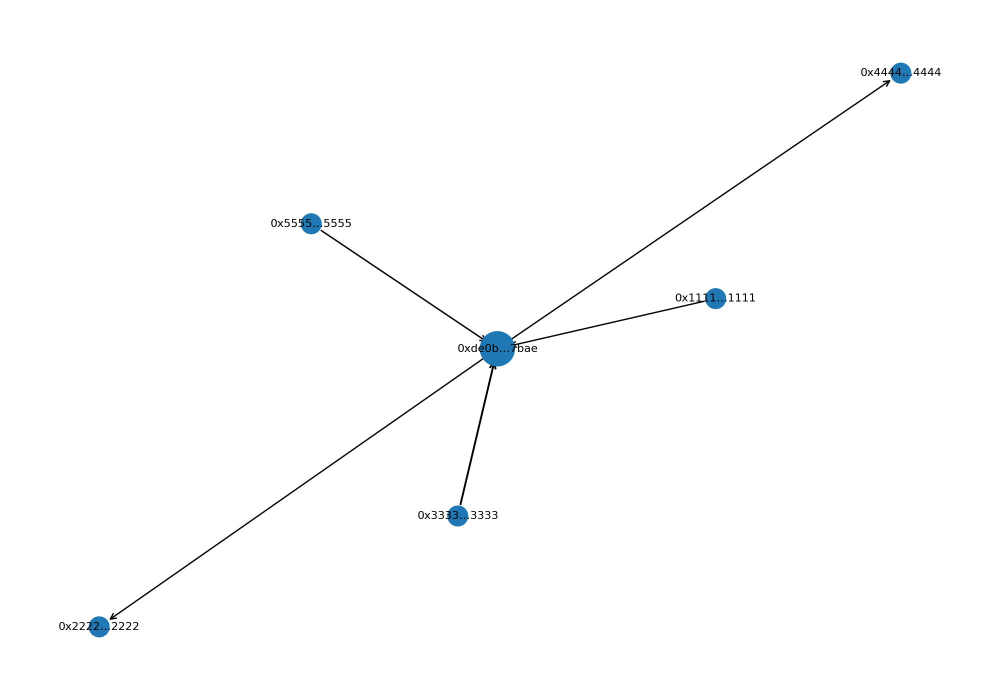
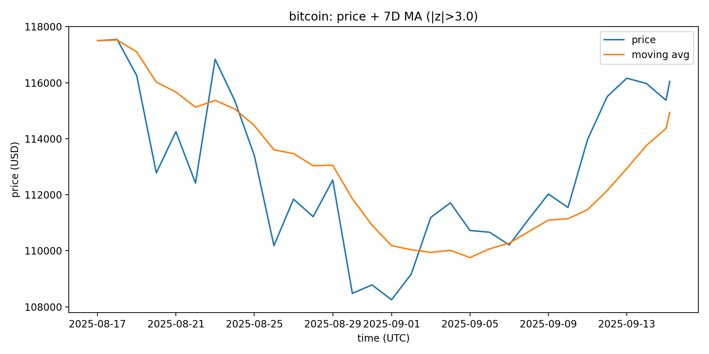
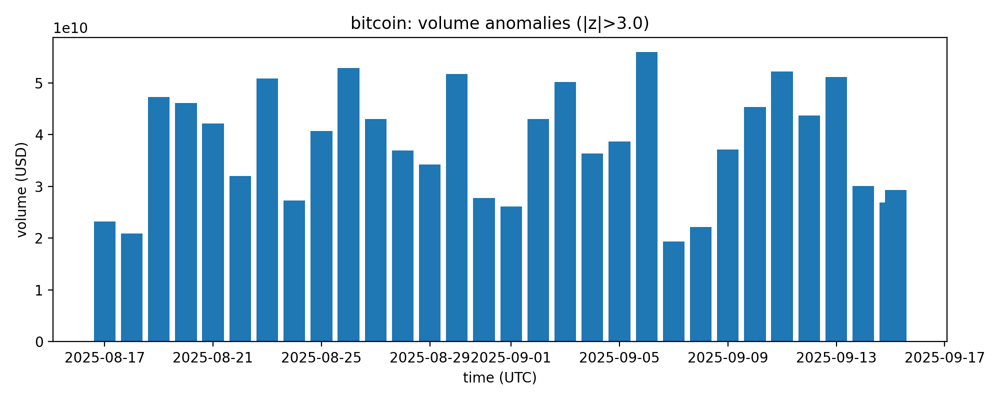
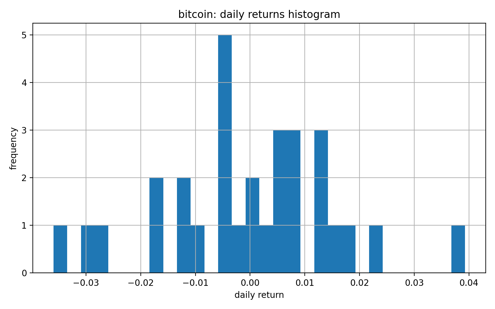

# Crypto Forensics Assessment — Task 1 & Task 2

## Project Overview
**Task 1 (Wallet Graph):** Query recent Ethereum transactions for a known public wallet (Ethereum Foundation: `0xde0B295669a9FD93d5F28D9Ec85E40f4cb697BAe`), normalize them, and output:
- a **directed network graph** of the last *N* transactions,
- a **CSV** of those transactions,
- a **plain-English summary** (inflow/outflow, counterparties).
Nodes = wallet addresses; Edges = transactions (`from → to`).

**Task 2 (Market Forensics):** Pull recent daily **price & volume** for a token, compute basic anomaly scores (z-scores) for **returns** and **volume**, and output:
- a **price time series** with moving average and anomaly markers,
- a **volume chart** with spikes highlighted,
- a **histogram** of daily returns,
- a short **text report** summarizing flagged days.  
(Uses CoinGecko; automatically falls back to a small fixture so it runs offline.)

---

## Installation (Windows / VS Code)

```powershell
# from the repo root
python -m venv .venv
.\.venv\Scripts\python.exe -m pip install --upgrade pip
.\.venv\Scripts\python.exe -m pip install -r requirements.txt
```

---

## Example usage
**Task 1: Wallet Graph (Ethereum Foundation)**
$env:PYTHONPATH="."
.\.venv\Scripts\python.exe -u scripts\task1_wallet_graph.py --n 15

### Outputs created:
1. figs/wallet_graph.png
2. data/processed/txn_sample.csv
3. data/processed/wallet_summary.txt

### Task 1 — Simple Insights (Bonus)
- I looked at the **latest 5 transactions** on the Ethereum Foundation wallet.
- Money **coming in** was about **0.60 ETH** and **going out** was **0.13 ETH**, so the wallet **ended up +0.47 ETH** overall.
- It interacted with a **small number of other wallets** (3 sent to it, 2 it sent to) — that’s normal and not noisy.
- I *didn’t see any “quick in, quick out” moves**, no back-and-forth ping-pong between the same two wallets, and no sudden burst of payments to lots of new wallets.
- The **amounts are small**, and nothing here obviously looks shady.

> Note: This is based on just 5 recent transactions. Signs that would look suspicious include:
> lots of very fast hops (peel chains), many tiny split transfers, repeated round-trips between two wallets, sending to known mixer services/exchanges in odd patterns, or unusually high fees.

**Task 2: Market Forensics (CoinGecko, 30 days)**
$env:PYTHONPATH="."
.\.venv\Scripts\python.exe -u scripts\task2_market_forensics.py --coin-id bitcoin --days 30 --ma 7 --z 3.0

### Outputs
1. figs/price_ma_bitcoin.png
2. figs/volume_anoms_bitcoin.png
3. figs/returns_hist_bitcoin.png
4. data/processed/ohlcv_bitcoin.csv
5. data/processed/market_report_bitcoin.txt

## Screenshot




